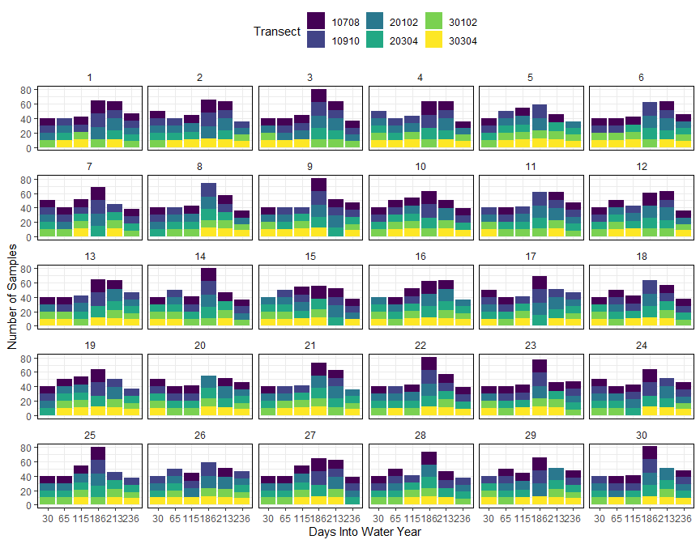

```r
# Import data
uav.dt <- read_rds(file.path(procDataDir, "uav_data4.rds"))
```

## Standardize variables
**The standardization (centering and scaling) is done based on mean and variance of entire dataset. 
This should not meaningfully affect the independence of the hold-out test sets.**


```r
pred.names <- names(uav.dt)[-(1:4)]
pred.names
```

```
##  [1] "roll1.Precip"    "roll1.et"        "roll2.Precip"    "roll15.Precip"   "roll15.et"       "roll30.Precip"   "A_MF_dsm_100"   
##  [8] "A_MF_dsm_300"    "A_MF_dsm_500"    "A_MF_dsm_60"     "C_Pla_dsm_100"   "C_Pla_dsm_300"   "C_Pla_dsm_500"   "C_Pla_dsm_5000" 
## [15] "C_Pla_dsm_60"    "C_Pro_dsm_100"   "C_Pro_dsm_300"   "C_Pro_dsm_500"   "C_Pro_dsm_5000"  "DINF_dsm_100"    "DINF_dsm_300"   
## [22] "DINF_dsm_500"    "DINF_dsm_60"     "E_dsm_300"       "E_dsm_500"       "E_dsm_60"        "N_dsm_300"       "N_dsm_500"      
## [29] "N_dsm_60"        "N_S_dsm_300"     "N_S_dsm_500"     "N_S_dsm_60"      "NTWI_MF_dsm_100" "NTWI_MF_dsm_60"  "S_dsm_100"      
## [36] "S_dsm_300"       "S_dsm_500"       "S_dsm_60"        "TPI_1_3_100"     "TPI_1_3_300"     "TPI_1_3_500"     "TPI_3_20_500"   
## [43] "TPI_3_7_100"     "TPI_3_7_300"     "TPI_3_7_500"     "ed_100"          "ed_300"          "ed_60"           "g_100"          
## [50] "g_300"           "g_60"            "nir_100"         "nir_300"         "nir_60"          "r_100"           "r_300"          
## [57] "r_60"            "ttvi_100"        "ttvi_300"        "ttvi_60"
```

```r
pp <- preProcess(uav.dt, method = list(center = pred.names , scale = pred.names))
#Preprocess tables
std_uav.dt <- stats::predict(pp, uav.dt)

saveRDS(std_uav.dt, file = file.path(procDataDir, "std_uav_data_v3.rds"), version = 2)
```

## Training and testing set split
For the testing set, we will select two transects at random from 
4 of the 6 sampling days, and select one transect from each of the
remaining 2 sampling dates. This will ensure that:

1. all six days are represented in the training set.
2. training set is between 70 and 80 percent (i.e. 284 and 325 records).

Number of records within date-transect group:


```r
kable(table(uav.dt$wyd, uav.dt$Transect)) %>%
  kable_styling(bootstrap_options = c("striped", "hover", "condensed"), full_width = F)
```

<table class="table table-striped table-hover table-condensed" style="width: auto !important; margin-left: auto; margin-right: auto;">
 <thead>
  <tr>
   <th style="text-align:left;">   </th>
   <th style="text-align:right;"> 10708 </th>
   <th style="text-align:right;"> 10910 </th>
   <th style="text-align:right;"> 20102 </th>
   <th style="text-align:right;"> 20304 </th>
   <th style="text-align:right;"> 30102 </th>
   <th style="text-align:right;"> 30304 </th>
  </tr>
 </thead>
<tbody>
  <tr>
   <td style="text-align:left;"> 30 </td>
   <td style="text-align:right;"> 10 </td>
   <td style="text-align:right;"> 10 </td>
   <td style="text-align:right;"> 10 </td>
   <td style="text-align:right;"> 10 </td>
   <td style="text-align:right;"> 10 </td>
   <td style="text-align:right;"> 10 </td>
  </tr>
  <tr>
   <td style="text-align:left;"> 65 </td>
   <td style="text-align:right;"> 10 </td>
   <td style="text-align:right;"> 10 </td>
   <td style="text-align:right;"> 10 </td>
   <td style="text-align:right;"> 10 </td>
   <td style="text-align:right;"> 10 </td>
   <td style="text-align:right;"> 10 </td>
  </tr>
  <tr>
   <td style="text-align:left;"> 115 </td>
   <td style="text-align:right;"> 11 </td>
   <td style="text-align:right;"> 10 </td>
   <td style="text-align:right;"> 12 </td>
   <td style="text-align:right;"> 10 </td>
   <td style="text-align:right;"> 10 </td>
   <td style="text-align:right;"> 11 </td>
  </tr>
  <tr>
   <td style="text-align:left;"> 186 </td>
   <td style="text-align:right;"> 18 </td>
   <td style="text-align:right;"> 19 </td>
   <td style="text-align:right;"> 17 </td>
   <td style="text-align:right;"> 15 </td>
   <td style="text-align:right;"> 11 </td>
   <td style="text-align:right;"> 12 </td>
  </tr>
  <tr>
   <td style="text-align:left;"> 213 </td>
   <td style="text-align:right;"> 12 </td>
   <td style="text-align:right;"> 11 </td>
   <td style="text-align:right;"> 17 </td>
   <td style="text-align:right;"> 12 </td>
   <td style="text-align:right;"> 11 </td>
   <td style="text-align:right;"> 11 </td>
  </tr>
  <tr>
   <td style="text-align:left;"> 236 </td>
   <td style="text-align:right;"> 10 </td>
   <td style="text-align:right;"> 10 </td>
   <td style="text-align:right;"> 9 </td>
   <td style="text-align:right;"> 10 </td>
   <td style="text-align:right;"> 8 </td>
   <td style="text-align:right;"> 9 </td>
  </tr>
</tbody>
</table>

Each combination of date:transect on average has
`11.28`
records. For the training set:
within four randomely selected dates select 4 random transects and
5 random transects within the remaining two sampling dates.


```r
make_trainset <- function(x, uav.dt){
  all_transects <- as.character(unique(uav.dt$Transect))
  all_wyds <- unique(uav.dt$wyd)
  # subset with 4 transects from 4 days
  wyd4 <- sample(all_wyds, 4, replace = F)
  train_set4 <- tibble()
  for (wyd in wyd4){
    Transect <- sample(all_transects, 4, replace = F)
    train_set.i <- tidyr::crossing(wyd, Transect)
    train_set4 <- bind_rows(train_set4, train_set.i)
  }
  
  # subset with 5 Transect from the REMAINING two days
  wyd2 <- all_wyds[!all_wyds %in% wyd4]
  train_set5 <- tibble()
  for (wyd in wyd2){
    Transect <- sample(all_transects, 5)
    train_set.i2 <- tidyr::crossing(wyd, Transect)
    train_set5 <- bind_rows(train_set5, train_set.i2)
  }
  # complate training set
  train_set <- bind_rows(train_set4, train_set5)
  train_set <- train_set %>% 
    arrange(wyd, Transect)
  return(train_set)
}
```

Produce 15 random split indices


```r
# Create 100 indices and remove duplicates...
train.lst <- lapply(1:60, make_trainset, uav.dt)
# Remove duplicates
train.lst <- train.lst[!duplicated(train.lst)]
# Check duplicates!
for (i in 1:length(train.lst)){
  for (j in 1:length(train.lst)){
    if(i != j){
      dup = identical(train.lst[[i]], train.lst[[j]])
      if(dup){
      print(paste("Duplicates", i, "and", j))
        }
    }
    
  }
  
}
```

Keep only 30 splits for training set.


```r
length(train.lst)
```

```
## [1] 60
```

```r
train.lst <- train.lst[1:30]
```

Get index of sets to be used


```r
# Save the training random split references  
#Version 2 is compatible with R 3.5 current version in MERCED cluster.
saveRDS(train.lst, file = file.path(procDataDir, "train_split_list.rds"), version = 2)
```

## Summarize Training and Testing Sets
Create a list of the
`30`
 training and testing set tables.


```r
resampleListFunction <- function(trainset.lst, mydata, train = TRUE, rem.cols = TRUE){
  if (train){
    sub.dt <- left_join(trainset.lst, mydata, 
                        by = c( "wyd","Transect"))
  }else {
    sub.dt <- anti_join(mydata, trainset.lst, 
                        by = c( "wyd", "Transect"))
  }
  if (rem.cols){
    # Remove non predictor columns:
    sub.dt <- subset(sub.dt, select= -c(Transect, Distance, wyd))
  }
  return(sub.dt)
}
# Generate list of train and test data frames
# Import from the saved version
#train.lst <- readRDS(file.path(procDataDir, "train_split_list.rds"))
train.dt.lst = lapply(train.lst, 
                     resampleListFunction, 
                     mydata = uav.dt, 
                     train = TRUE,
                     rem.cols = FALSE)

test.dt.lst = lapply(train.lst, 
                     resampleListFunction, 
                     mydata = uav.dt, 
                     train = FALSE,
                     rem.cols = FALSE)

# Merge lists into a table
rbind_list <- function(table_list){
  c.dt <- data.frame()
  for (i in 1:length(table_list)){
    i.dt = table_list[[i]]
    i.dt$split_id = i 
    c.dt = bind_rows(c.dt, i.dt) 
  }
  
  return(c.dt)
}

train.dt <- rbind_list(train.dt.lst)
test.dt <- rbind_list(test.dt.lst)
```

### Summary of water year days and transects in each set


```r
summ_sets <- function(split_dt, keep.tran = FALSE){
  
  if(keep.tran){
    split_dt <- split_dt %>% 
      dplyr::group_by(split_id, wyd, Transect) %>% 
      dplyr::summarise(count_sample = n())
  }else{
    split_dt <- split_dt %>% 
      dplyr::group_by(split_id) %>% 
      dplyr::summarise(count_wyd = length(unique(wyd)),
                       count_tran = length(unique(Transect)),
                       tran = paste(unique(Transect), collapse = ", "),
                       count_sample = n())
  }
  return(split_dt)
}

summ.train <- summ_sets(train.dt)
summ.test <- summ_sets(test.dt)
```

Training set


```r
kable(mlr::summarizeColumns(summ.train) ) %>%
  kable_styling(bootstrap_options = c("striped", "hover", "condensed"), full_width = F)
```

<table class="table table-striped table-hover table-condensed" style="width: auto !important; margin-left: auto; margin-right: auto;">
 <thead>
  <tr>
   <th style="text-align:left;"> name </th>
   <th style="text-align:left;"> type </th>
   <th style="text-align:right;"> na </th>
   <th style="text-align:right;"> mean </th>
   <th style="text-align:right;"> disp </th>
   <th style="text-align:right;"> median </th>
   <th style="text-align:right;"> mad </th>
   <th style="text-align:right;"> min </th>
   <th style="text-align:right;"> max </th>
   <th style="text-align:right;"> nlevs </th>
  </tr>
 </thead>
<tbody>
  <tr>
   <td style="text-align:left;"> split_id </td>
   <td style="text-align:left;"> integer </td>
   <td style="text-align:right;"> 0 </td>
   <td style="text-align:right;"> 15.5 </td>
   <td style="text-align:right;"> 8.8034084 </td>
   <td style="text-align:right;"> 15.5 </td>
   <td style="text-align:right;"> 11.1195 </td>
   <td style="text-align:right;"> 1 </td>
   <td style="text-align:right;"> 30 </td>
   <td style="text-align:right;"> 0 </td>
  </tr>
  <tr>
   <td style="text-align:left;"> count_wyd </td>
   <td style="text-align:left;"> integer </td>
   <td style="text-align:right;"> 0 </td>
   <td style="text-align:right;"> 6.0 </td>
   <td style="text-align:right;"> 0.0000000 </td>
   <td style="text-align:right;"> 6.0 </td>
   <td style="text-align:right;"> 0.0000 </td>
   <td style="text-align:right;"> 6 </td>
   <td style="text-align:right;"> 6 </td>
   <td style="text-align:right;"> 0 </td>
  </tr>
  <tr>
   <td style="text-align:left;"> count_tran </td>
   <td style="text-align:left;"> integer </td>
   <td style="text-align:right;"> 0 </td>
   <td style="text-align:right;"> 6.0 </td>
   <td style="text-align:right;"> 0.0000000 </td>
   <td style="text-align:right;"> 6.0 </td>
   <td style="text-align:right;"> 0.0000 </td>
   <td style="text-align:right;"> 6 </td>
   <td style="text-align:right;"> 6 </td>
   <td style="text-align:right;"> 0 </td>
  </tr>
  <tr>
   <td style="text-align:left;"> tran </td>
   <td style="text-align:left;"> character </td>
   <td style="text-align:right;"> 0 </td>
   <td style="text-align:right;"> NA </td>
   <td style="text-align:right;"> 0.8333333 </td>
   <td style="text-align:right;"> NA </td>
   <td style="text-align:right;"> NA </td>
   <td style="text-align:right;"> 1 </td>
   <td style="text-align:right;"> 5 </td>
   <td style="text-align:right;"> 17 </td>
  </tr>
  <tr>
   <td style="text-align:left;"> count_sample </td>
   <td style="text-align:left;"> integer </td>
   <td style="text-align:right;"> 0 </td>
   <td style="text-align:right;"> 294.3 </td>
   <td style="text-align:right;"> 4.6767952 </td>
   <td style="text-align:right;"> 294.0 </td>
   <td style="text-align:right;"> 4.4478 </td>
   <td style="text-align:right;"> 284 </td>
   <td style="text-align:right;"> 304 </td>
   <td style="text-align:right;"> 0 </td>
  </tr>
</tbody>
</table>

Testing set


```r
kable(mlr::summarizeColumns(summ.test)) %>%
  kable_styling(bootstrap_options = c("striped", "hover", "condensed"), full_width = F)
```

<table class="table table-striped table-hover table-condensed" style="width: auto !important; margin-left: auto; margin-right: auto;">
 <thead>
  <tr>
   <th style="text-align:left;"> name </th>
   <th style="text-align:left;"> type </th>
   <th style="text-align:right;"> na </th>
   <th style="text-align:right;"> mean </th>
   <th style="text-align:right;"> disp </th>
   <th style="text-align:right;"> median </th>
   <th style="text-align:right;"> mad </th>
   <th style="text-align:right;"> min </th>
   <th style="text-align:right;"> max </th>
   <th style="text-align:right;"> nlevs </th>
  </tr>
 </thead>
<tbody>
  <tr>
   <td style="text-align:left;"> split_id </td>
   <td style="text-align:left;"> integer </td>
   <td style="text-align:right;"> 0 </td>
   <td style="text-align:right;"> 15.5 </td>
   <td style="text-align:right;"> 8.8034084 </td>
   <td style="text-align:right;"> 15.5 </td>
   <td style="text-align:right;"> 11.1195 </td>
   <td style="text-align:right;"> 1 </td>
   <td style="text-align:right;"> 30 </td>
   <td style="text-align:right;"> 0 </td>
  </tr>
  <tr>
   <td style="text-align:left;"> count_wyd </td>
   <td style="text-align:left;"> integer </td>
   <td style="text-align:right;"> 0 </td>
   <td style="text-align:right;"> 6.0 </td>
   <td style="text-align:right;"> 0.0000000 </td>
   <td style="text-align:right;"> 6.0 </td>
   <td style="text-align:right;"> 0.0000 </td>
   <td style="text-align:right;"> 6 </td>
   <td style="text-align:right;"> 6 </td>
   <td style="text-align:right;"> 0 </td>
  </tr>
  <tr>
   <td style="text-align:left;"> count_tran </td>
   <td style="text-align:left;"> integer </td>
   <td style="text-align:right;"> 0 </td>
   <td style="text-align:right;"> 5.2 </td>
   <td style="text-align:right;"> 0.7143842 </td>
   <td style="text-align:right;"> 5.0 </td>
   <td style="text-align:right;"> 1.4826 </td>
   <td style="text-align:right;"> 4 </td>
   <td style="text-align:right;"> 6 </td>
   <td style="text-align:right;"> 0 </td>
  </tr>
  <tr>
   <td style="text-align:left;"> tran </td>
   <td style="text-align:left;"> character </td>
   <td style="text-align:right;"> 0 </td>
   <td style="text-align:right;"> NA </td>
   <td style="text-align:right;"> 0.9333333 </td>
   <td style="text-align:right;"> NA </td>
   <td style="text-align:right;"> NA </td>
   <td style="text-align:right;"> 1 </td>
   <td style="text-align:right;"> 2 </td>
   <td style="text-align:right;"> 29 </td>
  </tr>
  <tr>
   <td style="text-align:left;"> count_sample </td>
   <td style="text-align:left;"> integer </td>
   <td style="text-align:right;"> 0 </td>
   <td style="text-align:right;"> 111.7 </td>
   <td style="text-align:right;"> 4.6767952 </td>
   <td style="text-align:right;"> 112.0 </td>
   <td style="text-align:right;"> 4.4478 </td>
   <td style="text-align:right;"> 102 </td>
   <td style="text-align:right;"> 122 </td>
   <td style="text-align:right;"> 0 </td>
  </tr>
</tbody>
</table>

### Distribution of samples across transect and sampling dates


```r
plot_summ <- function(split_dt){
  summ_split_dt <- summ_sets(split_dt, keep.tran = T)
  
  bp <- ggplot(data = summ_split_dt, aes(y = count_sample, x = factor(wyd)))+
    geom_bar(aes(fill = Transect), stat="identity")+
    labs(x = "Days Into Water Year",
         y = "Number of Samples")+
    theme_bw()+
    theme(legend.position="top",
          strip.background = element_blank(),
          panel.border = element_rect(colour = "black"))+
    scale_fill_viridis_d()+
    facet_wrap(~split_id, ncol = 6)
    
  return(bp)
}

p.train <- plot_summ(train.dt)
p.test <- plot_summ(test.dt)
```

Training sets


```r
p.train
```

<!-- -->

Testing sets


```r
p.test
```

<!-- -->

### Detailed summary of sampling dates and transects in each set
Training set


```r
kable(summ.train) %>%
  kable_styling(bootstrap_options = c("striped", "hover", "condensed"), full_width = F)
```

<table class="table table-striped table-hover table-condensed" style="width: auto !important; margin-left: auto; margin-right: auto;">
 <thead>
  <tr>
   <th style="text-align:right;"> split_id </th>
   <th style="text-align:right;"> count_wyd </th>
   <th style="text-align:right;"> count_tran </th>
   <th style="text-align:left;"> tran </th>
   <th style="text-align:right;"> count_sample </th>
  </tr>
 </thead>
<tbody>
  <tr>
   <td style="text-align:right;"> 1 </td>
   <td style="text-align:right;"> 6 </td>
   <td style="text-align:right;"> 6 </td>
   <td style="text-align:left;"> 10708, 10910, 20102, 30102, 20304, 30304 </td>
   <td style="text-align:right;"> 297 </td>
  </tr>
  <tr>
   <td style="text-align:right;"> 2 </td>
   <td style="text-align:right;"> 6 </td>
   <td style="text-align:right;"> 6 </td>
   <td style="text-align:left;"> 10708, 10910, 20102, 20304, 30102, 30304 </td>
   <td style="text-align:right;"> 299 </td>
  </tr>
  <tr>
   <td style="text-align:right;"> 3 </td>
   <td style="text-align:right;"> 6 </td>
   <td style="text-align:right;"> 6 </td>
   <td style="text-align:left;"> 10708, 20102, 30102, 30304, 10910, 20304 </td>
   <td style="text-align:right;"> 304 </td>
  </tr>
  <tr>
   <td style="text-align:right;"> 4 </td>
   <td style="text-align:right;"> 6 </td>
   <td style="text-align:right;"> 6 </td>
   <td style="text-align:left;"> 10910, 20102, 20304, 30102, 30304, 10708 </td>
   <td style="text-align:right;"> 295 </td>
  </tr>
  <tr>
   <td style="text-align:right;"> 5 </td>
   <td style="text-align:right;"> 6 </td>
   <td style="text-align:right;"> 6 </td>
   <td style="text-align:left;"> 10708, 10910, 20304, 30102, 20102, 30304 </td>
   <td style="text-align:right;"> 285 </td>
  </tr>
  <tr>
   <td style="text-align:right;"> 6 </td>
   <td style="text-align:right;"> 6 </td>
   <td style="text-align:right;"> 6 </td>
   <td style="text-align:left;"> 10708, 10910, 30102, 30304, 20304, 20102 </td>
   <td style="text-align:right;"> 293 </td>
  </tr>
  <tr>
   <td style="text-align:right;"> 7 </td>
   <td style="text-align:right;"> 6 </td>
   <td style="text-align:right;"> 6 </td>
   <td style="text-align:left;"> 10708, 10910, 20102, 20304, 30102, 30304 </td>
   <td style="text-align:right;"> 294 </td>
  </tr>
  <tr>
   <td style="text-align:right;"> 8 </td>
   <td style="text-align:right;"> 6 </td>
   <td style="text-align:right;"> 6 </td>
   <td style="text-align:left;"> 10708, 10910, 20102, 20304, 30102, 30304 </td>
   <td style="text-align:right;"> 290 </td>
  </tr>
  <tr>
   <td style="text-align:right;"> 9 </td>
   <td style="text-align:right;"> 6 </td>
   <td style="text-align:right;"> 6 </td>
   <td style="text-align:left;"> 10708, 20102, 30102, 30304, 10910, 20304 </td>
   <td style="text-align:right;"> 301 </td>
  </tr>
  <tr>
   <td style="text-align:right;"> 10 </td>
   <td style="text-align:right;"> 6 </td>
   <td style="text-align:right;"> 6 </td>
   <td style="text-align:left;"> 10708, 10910, 20304, 30102, 30304, 20102 </td>
   <td style="text-align:right;"> 297 </td>
  </tr>
  <tr>
   <td style="text-align:right;"> 11 </td>
   <td style="text-align:right;"> 6 </td>
   <td style="text-align:right;"> 6 </td>
   <td style="text-align:left;"> 10910, 20102, 30102, 30304, 10708, 20304 </td>
   <td style="text-align:right;"> 293 </td>
  </tr>
  <tr>
   <td style="text-align:right;"> 12 </td>
   <td style="text-align:right;"> 6 </td>
   <td style="text-align:right;"> 6 </td>
   <td style="text-align:left;"> 10708, 10910, 20304, 30102, 20102, 30304 </td>
   <td style="text-align:right;"> 293 </td>
  </tr>
  <tr>
   <td style="text-align:right;"> 13 </td>
   <td style="text-align:right;"> 6 </td>
   <td style="text-align:right;"> 6 </td>
   <td style="text-align:left;"> 10708, 20102, 30102, 30304, 10910, 20304 </td>
   <td style="text-align:right;"> 295 </td>
  </tr>
  <tr>
   <td style="text-align:right;"> 14 </td>
   <td style="text-align:right;"> 6 </td>
   <td style="text-align:right;"> 6 </td>
   <td style="text-align:left;"> 10708, 20304, 30102, 30304, 10910, 20102 </td>
   <td style="text-align:right;"> 294 </td>
  </tr>
  <tr>
   <td style="text-align:right;"> 15 </td>
   <td style="text-align:right;"> 6 </td>
   <td style="text-align:right;"> 6 </td>
   <td style="text-align:left;"> 20102, 20304, 30102, 30304, 10910, 10708 </td>
   <td style="text-align:right;"> 290 </td>
  </tr>
  <tr>
   <td style="text-align:right;"> 16 </td>
   <td style="text-align:right;"> 6 </td>
   <td style="text-align:right;"> 6 </td>
   <td style="text-align:left;"> 20102, 20304, 30102, 30304, 10708, 10910 </td>
   <td style="text-align:right;"> 293 </td>
  </tr>
  <tr>
   <td style="text-align:right;"> 17 </td>
   <td style="text-align:right;"> 6 </td>
   <td style="text-align:right;"> 6 </td>
   <td style="text-align:left;"> 10708, 10910, 20102, 20304, 30304, 30102 </td>
   <td style="text-align:right;"> 297 </td>
  </tr>
  <tr>
   <td style="text-align:right;"> 18 </td>
   <td style="text-align:right;"> 6 </td>
   <td style="text-align:right;"> 6 </td>
   <td style="text-align:left;"> 10708, 20304, 30102, 30304, 10910, 20102 </td>
   <td style="text-align:right;"> 290 </td>
  </tr>
  <tr>
   <td style="text-align:right;"> 19 </td>
   <td style="text-align:right;"> 6 </td>
   <td style="text-align:right;"> 6 </td>
   <td style="text-align:left;"> 10708, 10910, 20102, 20304, 30102, 30304 </td>
   <td style="text-align:right;"> 295 </td>
  </tr>
  <tr>
   <td style="text-align:right;"> 20 </td>
   <td style="text-align:right;"> 6 </td>
   <td style="text-align:right;"> 6 </td>
   <td style="text-align:left;"> 10708, 10910, 20304, 30102, 30304, 20102 </td>
   <td style="text-align:right;"> 284 </td>
  </tr>
  <tr>
   <td style="text-align:right;"> 21 </td>
   <td style="text-align:right;"> 6 </td>
   <td style="text-align:right;"> 6 </td>
   <td style="text-align:left;"> 10708, 20102, 20304, 30102, 10910, 30304 </td>
   <td style="text-align:right;"> 293 </td>
  </tr>
  <tr>
   <td style="text-align:right;"> 22 </td>
   <td style="text-align:right;"> 6 </td>
   <td style="text-align:right;"> 6 </td>
   <td style="text-align:left;"> 10708, 20102, 20304, 30102, 10910, 30304 </td>
   <td style="text-align:right;"> 300 </td>
  </tr>
  <tr>
   <td style="text-align:right;"> 23 </td>
   <td style="text-align:right;"> 6 </td>
   <td style="text-align:right;"> 6 </td>
   <td style="text-align:left;"> 10708, 20102, 30102, 30304, 10910, 20304 </td>
   <td style="text-align:right;"> 292 </td>
  </tr>
  <tr>
   <td style="text-align:right;"> 24 </td>
   <td style="text-align:right;"> 6 </td>
   <td style="text-align:right;"> 6 </td>
   <td style="text-align:left;"> 10708, 10910, 20102, 20304, 30102, 30304 </td>
   <td style="text-align:right;"> 294 </td>
  </tr>
  <tr>
   <td style="text-align:right;"> 25 </td>
   <td style="text-align:right;"> 6 </td>
   <td style="text-align:right;"> 6 </td>
   <td style="text-align:left;"> 10708, 20102, 20304, 30102, 30304, 10910 </td>
   <td style="text-align:right;"> 296 </td>
  </tr>
  <tr>
   <td style="text-align:right;"> 26 </td>
   <td style="text-align:right;"> 6 </td>
   <td style="text-align:right;"> 6 </td>
   <td style="text-align:left;"> 10910, 20102, 20304, 30304, 30102, 10708 </td>
   <td style="text-align:right;"> 290 </td>
  </tr>
  <tr>
   <td style="text-align:right;"> 27 </td>
   <td style="text-align:right;"> 6 </td>
   <td style="text-align:right;"> 6 </td>
   <td style="text-align:left;"> 10708, 20102, 20304, 30102, 30304, 10910 </td>
   <td style="text-align:right;"> 299 </td>
  </tr>
  <tr>
   <td style="text-align:right;"> 28 </td>
   <td style="text-align:right;"> 6 </td>
   <td style="text-align:right;"> 6 </td>
   <td style="text-align:left;"> 10708, 10910, 20304, 30102, 20102, 30304 </td>
   <td style="text-align:right;"> 287 </td>
  </tr>
  <tr>
   <td style="text-align:right;"> 29 </td>
   <td style="text-align:right;"> 6 </td>
   <td style="text-align:right;"> 6 </td>
   <td style="text-align:left;"> 10910, 20304, 30102, 30304, 10708, 20102 </td>
   <td style="text-align:right;"> 298 </td>
  </tr>
  <tr>
   <td style="text-align:right;"> 30 </td>
   <td style="text-align:right;"> 6 </td>
   <td style="text-align:right;"> 6 </td>
   <td style="text-align:left;"> 10910, 20102, 20304, 30102, 10708, 30304 </td>
   <td style="text-align:right;"> 301 </td>
  </tr>
</tbody>
</table>

Testing set


```r
kable(summ.test) %>%
  kable_styling(bootstrap_options = c("striped", "hover", "condensed"), full_width = F)
```

<table class="table table-striped table-hover table-condensed" style="width: auto !important; margin-left: auto; margin-right: auto;">
 <thead>
  <tr>
   <th style="text-align:right;"> split_id </th>
   <th style="text-align:right;"> count_wyd </th>
   <th style="text-align:right;"> count_tran </th>
   <th style="text-align:left;"> tran </th>
   <th style="text-align:right;"> count_sample </th>
  </tr>
 </thead>
<tbody>
  <tr>
   <td style="text-align:right;"> 1 </td>
   <td style="text-align:right;"> 6 </td>
   <td style="text-align:right;"> 5 </td>
   <td style="text-align:left;"> 20304, 30304, 10708, 30102, 20102 </td>
   <td style="text-align:right;"> 109 </td>
  </tr>
  <tr>
   <td style="text-align:right;"> 2 </td>
   <td style="text-align:right;"> 6 </td>
   <td style="text-align:right;"> 5 </td>
   <td style="text-align:left;"> 30304, 10708, 30102, 10910, 20304 </td>
   <td style="text-align:right;"> 107 </td>
  </tr>
  <tr>
   <td style="text-align:right;"> 3 </td>
   <td style="text-align:right;"> 6 </td>
   <td style="text-align:right;"> 4 </td>
   <td style="text-align:left;"> 10910, 20304, 30102, 30304 </td>
   <td style="text-align:right;"> 102 </td>
  </tr>
  <tr>
   <td style="text-align:right;"> 4 </td>
   <td style="text-align:right;"> 6 </td>
   <td style="text-align:right;"> 6 </td>
   <td style="text-align:left;"> 10708, 30102, 20304, 20102, 30304, 10910 </td>
   <td style="text-align:right;"> 111 </td>
  </tr>
  <tr>
   <td style="text-align:right;"> 5 </td>
   <td style="text-align:right;"> 6 </td>
   <td style="text-align:right;"> 5 </td>
   <td style="text-align:left;"> 20102, 30304, 10708, 10910, 20304 </td>
   <td style="text-align:right;"> 121 </td>
  </tr>
  <tr>
   <td style="text-align:right;"> 6 </td>
   <td style="text-align:right;"> 6 </td>
   <td style="text-align:right;"> 6 </td>
   <td style="text-align:left;"> 20102, 20304, 10910, 10708, 30304, 30102 </td>
   <td style="text-align:right;"> 113 </td>
  </tr>
  <tr>
   <td style="text-align:right;"> 7 </td>
   <td style="text-align:right;"> 6 </td>
   <td style="text-align:right;"> 5 </td>
   <td style="text-align:left;"> 30304, 20304, 20102, 30102, 10708 </td>
   <td style="text-align:right;"> 112 </td>
  </tr>
  <tr>
   <td style="text-align:right;"> 8 </td>
   <td style="text-align:right;"> 6 </td>
   <td style="text-align:right;"> 6 </td>
   <td style="text-align:left;"> 30304, 30102, 10708, 10910, 20102, 20304 </td>
   <td style="text-align:right;"> 116 </td>
  </tr>
  <tr>
   <td style="text-align:right;"> 9 </td>
   <td style="text-align:right;"> 6 </td>
   <td style="text-align:right;"> 6 </td>
   <td style="text-align:left;"> 10910, 20304, 10708, 30102, 20102, 30304 </td>
   <td style="text-align:right;"> 105 </td>
  </tr>
  <tr>
   <td style="text-align:right;"> 10 </td>
   <td style="text-align:right;"> 6 </td>
   <td style="text-align:right;"> 5 </td>
   <td style="text-align:left;"> 20102, 30304, 10910, 20304, 30102 </td>
   <td style="text-align:right;"> 109 </td>
  </tr>
  <tr>
   <td style="text-align:right;"> 11 </td>
   <td style="text-align:right;"> 6 </td>
   <td style="text-align:right;"> 4 </td>
   <td style="text-align:left;"> 10708, 20304, 20102, 30304 </td>
   <td style="text-align:right;"> 113 </td>
  </tr>
  <tr>
   <td style="text-align:right;"> 12 </td>
   <td style="text-align:right;"> 6 </td>
   <td style="text-align:right;"> 6 </td>
   <td style="text-align:left;"> 20102, 30304, 10910, 10708, 30102, 20304 </td>
   <td style="text-align:right;"> 113 </td>
  </tr>
  <tr>
   <td style="text-align:right;"> 13 </td>
   <td style="text-align:right;"> 6 </td>
   <td style="text-align:right;"> 6 </td>
   <td style="text-align:left;"> 10910, 20304, 20102, 10708, 30304, 30102 </td>
   <td style="text-align:right;"> 111 </td>
  </tr>
  <tr>
   <td style="text-align:right;"> 14 </td>
   <td style="text-align:right;"> 6 </td>
   <td style="text-align:right;"> 5 </td>
   <td style="text-align:left;"> 10910, 20102, 10708, 30304, 20304 </td>
   <td style="text-align:right;"> 112 </td>
  </tr>
  <tr>
   <td style="text-align:right;"> 15 </td>
   <td style="text-align:right;"> 6 </td>
   <td style="text-align:right;"> 6 </td>
   <td style="text-align:left;"> 10708, 10910, 30102, 20102, 30304, 20304 </td>
   <td style="text-align:right;"> 116 </td>
  </tr>
  <tr>
   <td style="text-align:right;"> 16 </td>
   <td style="text-align:right;"> 6 </td>
   <td style="text-align:right;"> 5 </td>
   <td style="text-align:left;"> 10708, 10910, 30304, 20102, 30102 </td>
   <td style="text-align:right;"> 113 </td>
  </tr>
  <tr>
   <td style="text-align:right;"> 17 </td>
   <td style="text-align:right;"> 6 </td>
   <td style="text-align:right;"> 4 </td>
   <td style="text-align:left;"> 30102, 20102, 30304, 10708 </td>
   <td style="text-align:right;"> 109 </td>
  </tr>
  <tr>
   <td style="text-align:right;"> 18 </td>
   <td style="text-align:right;"> 6 </td>
   <td style="text-align:right;"> 5 </td>
   <td style="text-align:left;"> 10910, 20102, 30304, 30102, 10708 </td>
   <td style="text-align:right;"> 116 </td>
  </tr>
  <tr>
   <td style="text-align:right;"> 19 </td>
   <td style="text-align:right;"> 6 </td>
   <td style="text-align:right;"> 6 </td>
   <td style="text-align:left;"> 30304, 30102, 10910, 20102, 10708, 20304 </td>
   <td style="text-align:right;"> 111 </td>
  </tr>
  <tr>
   <td style="text-align:right;"> 20 </td>
   <td style="text-align:right;"> 6 </td>
   <td style="text-align:right;"> 5 </td>
   <td style="text-align:left;"> 20102, 30304, 10708, 10910, 30102 </td>
   <td style="text-align:right;"> 122 </td>
  </tr>
  <tr>
   <td style="text-align:right;"> 21 </td>
   <td style="text-align:right;"> 6 </td>
   <td style="text-align:right;"> 5 </td>
   <td style="text-align:left;"> 10910, 30304, 10708, 20304, 20102 </td>
   <td style="text-align:right;"> 113 </td>
  </tr>
  <tr>
   <td style="text-align:right;"> 22 </td>
   <td style="text-align:right;"> 6 </td>
   <td style="text-align:right;"> 5 </td>
   <td style="text-align:left;"> 10910, 30304, 10708, 30102, 20102 </td>
   <td style="text-align:right;"> 106 </td>
  </tr>
  <tr>
   <td style="text-align:right;"> 23 </td>
   <td style="text-align:right;"> 6 </td>
   <td style="text-align:right;"> 5 </td>
   <td style="text-align:left;"> 10910, 20304, 20102, 30304, 30102 </td>
   <td style="text-align:right;"> 114 </td>
  </tr>
  <tr>
   <td style="text-align:right;"> 24 </td>
   <td style="text-align:right;"> 6 </td>
   <td style="text-align:right;"> 6 </td>
   <td style="text-align:left;"> 30304, 10910, 30102, 20102, 10708, 20304 </td>
   <td style="text-align:right;"> 112 </td>
  </tr>
  <tr>
   <td style="text-align:right;"> 25 </td>
   <td style="text-align:right;"> 6 </td>
   <td style="text-align:right;"> 4 </td>
   <td style="text-align:left;"> 10910, 30304, 10708, 20102 </td>
   <td style="text-align:right;"> 110 </td>
  </tr>
  <tr>
   <td style="text-align:right;"> 26 </td>
   <td style="text-align:right;"> 6 </td>
   <td style="text-align:right;"> 4 </td>
   <td style="text-align:left;"> 10708, 30102, 20304, 10910 </td>
   <td style="text-align:right;"> 116 </td>
  </tr>
  <tr>
   <td style="text-align:right;"> 27 </td>
   <td style="text-align:right;"> 6 </td>
   <td style="text-align:right;"> 5 </td>
   <td style="text-align:left;"> 10910, 30304, 20102, 30102, 20304 </td>
   <td style="text-align:right;"> 107 </td>
  </tr>
  <tr>
   <td style="text-align:right;"> 28 </td>
   <td style="text-align:right;"> 6 </td>
   <td style="text-align:right;"> 5 </td>
   <td style="text-align:left;"> 20102, 30304, 10708, 10910, 30102 </td>
   <td style="text-align:right;"> 119 </td>
  </tr>
  <tr>
   <td style="text-align:right;"> 29 </td>
   <td style="text-align:right;"> 6 </td>
   <td style="text-align:right;"> 6 </td>
   <td style="text-align:left;"> 10708, 20102, 30304, 10910, 30102, 20304 </td>
   <td style="text-align:right;"> 108 </td>
  </tr>
  <tr>
   <td style="text-align:right;"> 30 </td>
   <td style="text-align:right;"> 6 </td>
   <td style="text-align:right;"> 6 </td>
   <td style="text-align:left;"> 10708, 30304, 20304, 30102, 20102, 10910 </td>
   <td style="text-align:right;"> 105 </td>
  </tr>
</tbody>
</table>

